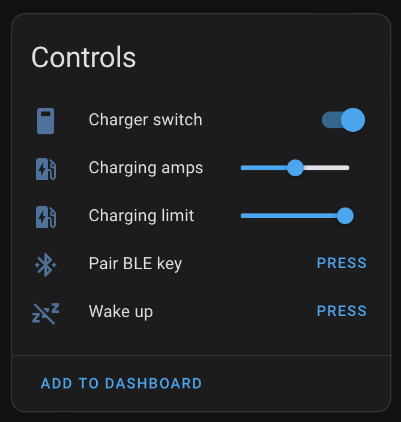

# ESPHome Tesla BLE

This project lets you use an ESP32 device to manage charging a Tesla vehicle over BLE. Tested with M5Stack NanoC6 and Tesla firmware 2024.20.9.



## Features
- [x] Pair BLE key with vehicle
- [x] Wake up vehicle (requires firmware 2024.20.9 or newer when using the [Charging Manager](https://github.com/teslamotors/vehicle-command/blob/main/pkg/protocol/protocol.md#roles) role)
- [x] Set charging amps
- [x] Set charging limit (percent)
- [x] Turn on/off charging

## Usage
### Flashing ESP32 firmware

1. Copy and rename `secrets.yaml.example` to `secrets.yaml` and update it with your WiFi credentials (`wifi_ssid` and `wifi_password`) and vehicle details (`ble_mac_address` and `tesla_vin`)

> To find the `ble_mac_address` of your vehicle, you can uncomment the `tesla_ble_listener` component in `packages/project.yml` and watch the logs.

2. Build the image with [ESPHome](https://esphome.io/guides/getting_started_command_line.html)

```sh
make compile
```

3. Upload/flash the firmware to the board.

```sh
make upload
```

### Pairing the BLE key with the vehicle
1. Get into your vehicle
2. In Home Assistant, go to Settings > Devices & Services > ESPHome > Tesla BLE device and click "Pair BLE key"
3. Tap your NFC card to your car's center console
4. Hit confirm on the screen
