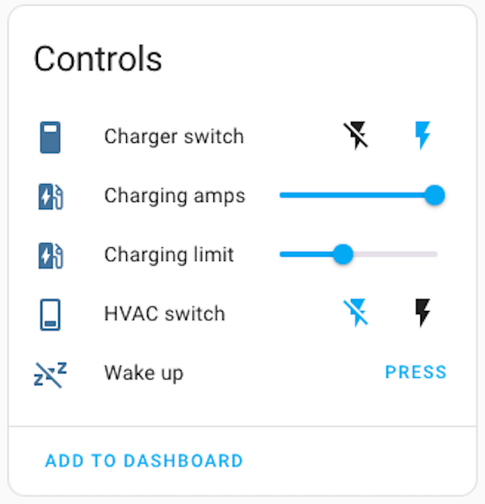
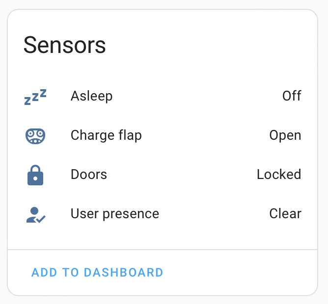
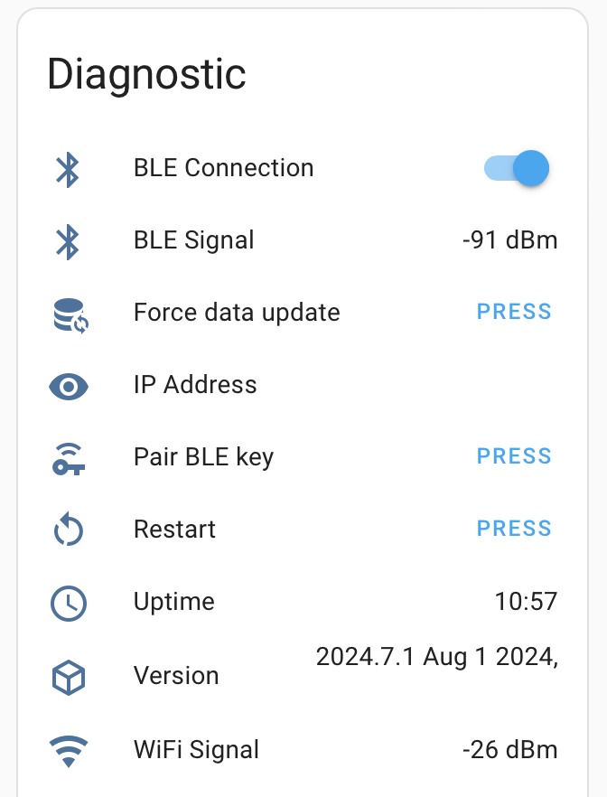
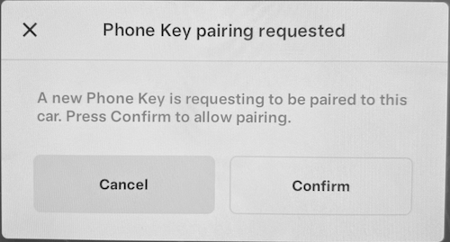
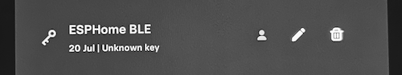

# ESPHome Tesla BLE

This project lets you use an ESP32 device to manage charging a Tesla vehicle over BLE, using the [yoziru/tesla-ble](http://github.com/yoziru/tesla-ble) library.
Tested with M5Stack NanoC6 and Tesla firmwares 2024.26.3.1.

| Controls | Sensors | Diagnostic |
| - | - | - |
|  |  |  |


## Features
- [x] Pair BLE key with vehicle
- [x] Wake up vehicle
  - [ ] Use [Charging Manager](https://github.com/teslamotors/vehicle-command/blob/main/pkg/protocol/protocol.md#roles) role (wake command [not yet supported](https://github.com/teslamotors/vehicle-command/issues/232#issuecomment-2181503570) as of 2024.26.3.1)
- [x] Set charging amps
- [x] Set charging limit (percent)
- [x] Turn on/off charging
- [x] Turn on/off HVAC
- [x] Turn on/off steering heat 
- [x] BLE information sensors
  - [x] Asleep / awake
  - [x] Doors locked / unlocked
  - [x] User present / not present
  - [x] Charging flap open / closed (only when vehicle is awake)
  - [x] BLE signal strength

## Usage

> For ESPHome dashboard, see [`tesla-ble-example.yml`](./tesla-ble.example.yml)

### Pre-requisites
- Python 3.10+
- GNU Make

### Finding the BLE MAC address of your vehicle

1. Copy and rename `secrets.yaml.example` to `secrets.yaml` and update it with your WiFi credentials (`wifi_ssid` and `wifi_password`) and vehicle VIN (`tesla_vin`).
1. Enable the `tesla_ble_listener` package in `packages/base.yml` by uncommenting the `listener: !include listener.yml` line.
1. Build and flash the firmware to your ESP32 device. See the 'Building and flashing ESP32 firmware' section below.
1. Open the ESPHome logs in Home Assistant and wake it up. Watch for the "Found Tesla vehicle" message, which will contain the BLE MAC address of your vehicle.
    > Note: The vehicle must be in range and awake for the BLE MAC address to be discovered. If the vehicle is not awake, open the Tesla app and run any command
    ```log
    [00:00:00][D][tesla_ble_listener:044]: Parsing device: [CC:BB:D1:E2:34:F0]: BLE Device name 1
    [00:00:00][D][tesla_ble_listener:044]: Parsing device: [19:8A:BB:C3:D2:1F]: 
    [00:00:00][D][tesla_ble_listener:044]: Parsing device: [19:8A:BB:C3:D2:1F]:
    [00:00:00][D][tesla_ble_listener:044]: Parsing device: [F5:4E:3D:C2:1B:A0]: BLE Device name 2
    [00:00:00][D][tesla_ble_listener:044]: Parsing device: [A0:B1:C2:D3:E4:F5]: S1a87a5a75f3df858C
    [00:00:00][I][tesla_ble_listener:054]: Found Tesla vehicle | Name: S1a87a5a75f3df858C | MAC: A0:B1:C2:D3:E4:F5
    ```
1. Clean up your environment before the next step by disabling the `tesla_ble_listener` package in `packages/base.yml` and running
    ```sh
    make clean
    ```


### Building and flashing ESP32 firmware
1. Connect your ESP32 device to your computer via USB
1. Copy and rename `secrets.yaml.example` to `secrets.yaml` and update it with your WiFi credentials (`wifi_ssid` and `wifi_password`) and vehicle details (`ble_mac_address` and `tesla_vin`)
1. Build the image with [ESPHome](https://esphome.io/guides/getting_started_command_line.html). Alternate boards are listed in the `boards/` directory.

    ```sh
    make compile BOARD=m5stack-nanoc6
    ```

1. Upload/flash the firmware to the board.

    ```sh
    make upload BOARD=m5stack-nanoc6
    ```

1. After flashing, you can use the log command to monitor the logs from the device. The host suffix is the last part of the device name in the ESPHome dashboard (e.g. `5b2ac7`).
    ```sh
    make logs HOST_SUFFIX=-5b2ac7
    ```

1. For updating your device, you can OTA update over local WiFi using the same host suffix:
    ```sh
    make upload HOST_SUFFIX=-5b2ac7
    ```

> Note: the make commands are just a wrapper around the `esphome` command. You can also use the `esphome` commands directly if you prefer (e.g. `esphome compile tesla-ble-m5stack-nanoc6.yml`)

### Adding the device to Home Assistant

1. In Home Assistant, go to Settings > Devices & Services. If your device is discovered automatically, you can add it by clicking the "Configure" button by the discovered device. If not, click the "+ Add integration" button and select "ESPHome" as the integration and enter the IP address of your device.
2. Enter the API encryption key from the `secrets.yaml` file when prompted.
3. That's it! You should now see the device in Home Assistant and be able to control it.


### Pairing the BLE key with your vehicle
1. Make sure your ESP32 device is close to the car (check the "BLE Signal" sensor) and the BLE MAC address and VIN in `secrets.yaml` is correct.
1. Get into your vehicle
1. In Home Assistant, go to Settings > Devices & Services > ESPHome, choose your Tesla BLE device and click "Pair BLE key"
1. Tap your NFC card to your car's center console
1. A prompt will appear on the screen of your car asking if you want to pair the key
    > Note: if the popup does not appear, you may need to press "Pair BLE key" and tap your card again

    
1. Hit confirm on the screen
1. To verify the key was added, tap Controls > Locks, and you should see a new key named "Unknown device" in the list
1. [optional] Rename your key to "ESPHome BLE" to make it easier to identify
    
