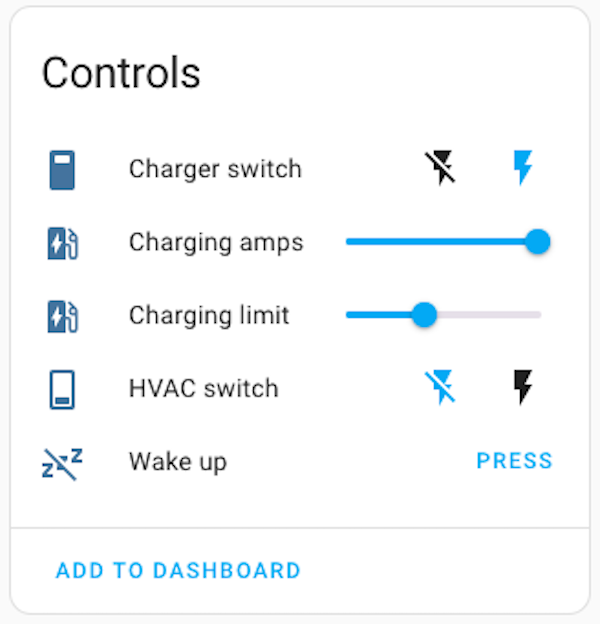
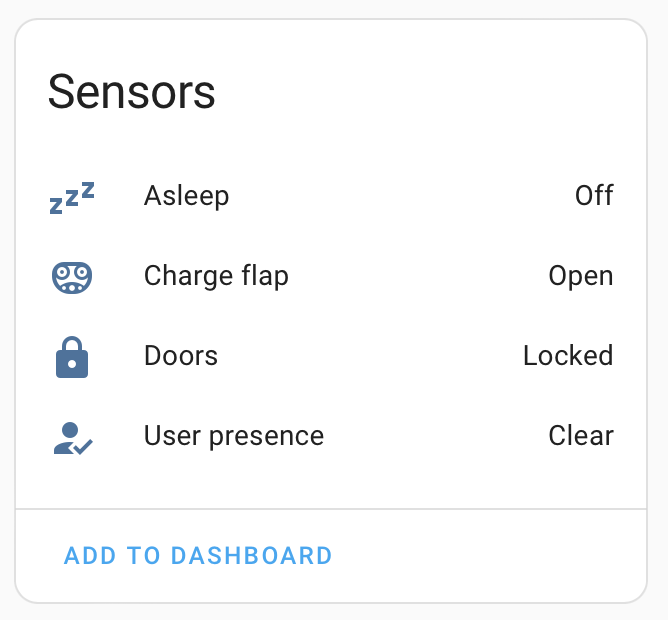
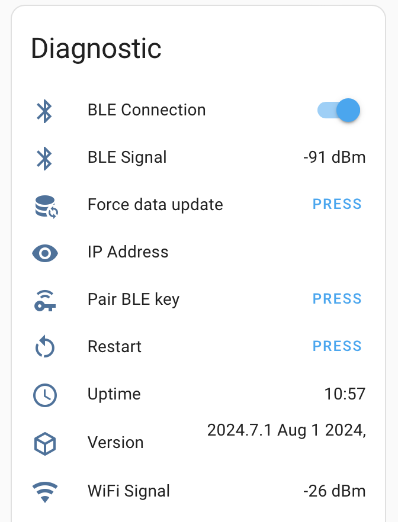

# ESPHome Tesla BLE

Manage your Tesla vehicle over BLE using an ESP32 device and [yoziru/tesla-ble](http://github.com/yoziru/tesla-ble).

| Controls | Sensors | Diagnostic |
| - | - | - |
|  |  |  |

## Quick Start

Set up your `secrets.yaml` with WiFi, VIN, and BLE MAC, then pick an install method:

| Method | Command | Best for |
|--------|---------|----------|
| **ESPHome Dashboard** | Paste a dashboard URL into the add-on | Users with HA + ESPHome add-on |
| **CLI** | `make compile && make upload` | Devs with Python/uv installed |
| **Docker** | `make compile_docker` | Users without Python on their machine |

Select your board's `.dashboard.yml` file:
- [`tesla-ble-m5stack-nanoc6.dashboard.yml`](./tesla-ble-m5stack-nanoc6.dashboard.yml) — M5Stack NanoC6 (ESP32-C6)
- [`tesla-ble-m5stack-atoms3.dashboard.yml`](./tesla-ble-m5stack-atoms3.dashboard.yml) — M5Stack AtomS3 (ESP32-S3)
- [`tesla-ble-esp32-generic.dashboard.yml`](./tesla-ble-esp32-generic.dashboard.yml) — Generic ESP32

## Features

- [x] Pair BLE key with vehicle (supports DRIVER and CHARGING_MANAGER roles)
- [x] Wake vehicle, set charging amps/limit, start/stop charging
- [x] Sensors: asleep/awake, locked/unlocked, user presence, charge port, BLE signal, IEC 61851
- [x] Charging sensors: battery level, charge rate, energy added, time to full, charger phases

## Installation

### ESPHome Dashboard (recommended)

If you run the ESPHome add-on in Home Assistant:

1. Go to the ESPHome dashboard → "New Device" → "Continue"
2. Paste the **dashboard import URL** for your board (see Quick Start table above)
3. The dashboard will pull the config from this repo
4. Add your secrets (WiFi, VIN, BLE MAC) in the dashboard's Secrets screen

> Example URL: `github://yoziru/esphome-tesla-ble/tesla-ble-m5stack-nanoc6.dashboard.yml@main`

Or use the example config as a starting point for your own modifications: [`tesla-ble.example.yml`](./tesla-ble.example.yml)

### CLI (local)

Requires Python 3.10+, GNU Make, and [uv](https://docs.astral.sh/uv/).

```sh
cp secrets.yaml.example secrets.yaml  # edit with your details
make compile BOARD=m5stack-nanoc6     # adjust BOARD for your hardware
make upload BOARD=m5stack-nanoc6      # flash via USB
make logs                             # view device logs
```

For OTA updates after initial flash:
```sh
make upload HOST_SUFFIX=-5b2ac7      # suffix from device name
```

Available boards: `m5stack-nanoc6`, `m5stack-atoms3`, `esp32-generic`. Add your own in `boards/`.

### Docker

Same as CLI but no Python install needed:

```sh
make compile_docker BOARD=m5stack-nanoc6
```

Uses `ghcr.io/esphome/esphome` image directly. Output lands in `.esphome/`.

## Configuration

### BLE Key Role

The `role` setting determines what the paired BLE key is allowed to do (set during pairing, change requires re-pair):

- **DRIVER** (default) — full access: lock/unlock, frunk/trunk, windows, honk, climate, charging
- **CHARGING_MANAGER** — charging only: start/stop, set amps, set limit, open charge port, basic info

The Tesla backend enforces these restrictions, not the component. Choose **CHARGING_MANAGER** if you only need charging control and want to limit the key's capabilities.

### Polling Intervals

```yaml
tesla_ble_vehicle:
  vcsec_poll_interval: 10               # Status: sleep, lock, user presence (always safe to poll)
  infotainment_poll_interval_awake: 30  # Battery/charging data when awake but not active
  infotainment_poll_interval_active: 10 # Same, but when charging/unlocked/user present
  infotainment_sleep_timeout: 660       # Minutes before allowing sleep (default: 11)
```

The system only polls infotainment data during an 11-minute wake window after the car becomes idle, then lets it sleep. Active states (charging, unlocked, user present) override this timeout for continuous monitoring. VCSEC status polling runs at low power and does not affect vehicle sleep.

## Usage

### Finding the BLE MAC

1. Copy `secrets.yaml.example` → `secrets.yaml`, set your WiFi and VIN
2. Uncomment `listener: !include listener.yml` in `packages/base.yml`
3. Build and flash
4. Open the logs, wake your car (Tesla app), watch for:
   ```
   [I][tesla_ble_listener:054]: Found Tesla vehicle | Name: S1a87a5a75f3df858C | MAC: A0:B1:C2:D3:E4:F5
   ```
5. Disable the listener package and run `make clean` before flashing your final build

### Pairing the BLE Key

1. Sit in your car with the ESP32 powered and in range
2. In Home Assistant: Settings → Devices & Services → ESPHome → your device → "Pair BLE key"
3. Immediately tap your NFC key card to the center console
4. A pairing prompt appears on the car's screen — tap **confirm**
5. [Optional] Rename the new key in Controls → Locks (it shows as "Unknown device")

> If the popup doesn't appear, press "Pair BLE key" and tap your card again.

### Adding to Home Assistant

Go to Settings → Devices & Services → Add Integration → **ESPHome**. Enter the device's IP address and your API encryption key. The device and all its entities appear automatically.

## Troubleshooting

| Symptom | Likely cause |
|---------|-------------|
| "Found Tesla vehicle" never appears | Car not awake. Open the Tesla app to wake it, then re-check logs. |
| Pairing fails with HMAC error | BLE MAC or VIN is wrong. Verify both in `secrets.yaml`. |
| Car stays awake | Car is in Sentry Mode, recently driven, or state is flapping. The 11-min timeout only counts idle time. |
| `Unknown` on boot | Normal for some sensors until the first VCSEC response arrives (~10s). |
| Compile errors | Check your board variant matches your hardware. Run `make clean` first. |
