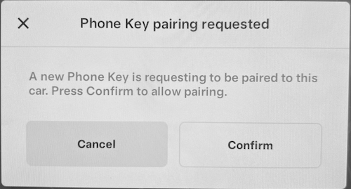
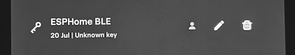

# ESPHome Tesla BLE

Manage your Tesla vehicle over BLE using an ESP32 — control charging, check battery status, lock/unlock, and more.

| Controls | Sensors | Diagnostic |
| - | - | - |
|  |  |  |

## Quick Start

1. Copy `secrets.yaml.example` → `secrets.yaml`, fill in your WiFi, VIN, and BLE MAC
2. Pick your install method:

| Method | How | Best for |
|--------|-----|----------|
| **ESPHome Dashboard** | Import a URL into the add-on (below) | HA + ESPHome add-on users |
| **CLI** | `make compile && make upload` | Users with Python + [uv](https://docs.astral.sh/uv/) |

New to Tesla BLE? Start with [finding your vehicle's BLE MAC](#finding-the-ble-mac).

## Boards

Pick the config for your hardware:

| Board | Dashboard URL | CLI |
|-------|--------------|-----|
| **M5Stack NanoC6** | `tesla-ble-finder-m5stack-nanoc6.dashboard.yml` | `BOARD=m5stack-nanoc6` |
| **M5Stack AtomS3** | `tesla-ble-finder-m5stack-atoms3.dashboard.yml` | `BOARD=m5stack-atoms3` |
| **Generic ESP32** | `tesla-ble-finder-esp32-generic.dashboard.yml` | `BOARD=esp32-generic` |

Other boards? Copy one from `boards/` and set it with `BOARD=<your-board>`.

## Features

- [x] Pair BLE key (DRIVER or CHARGING_MANAGER role)
- [x] Wake vehicle, set charging amps/limit, start/stop charging
- [x] Sensors: asleep/awake, locked/unlocked, user presence, charge port, BLE signal, IEC 61851
- [x] Charging sensors: battery level, charge rate, energy added, time to full, charger phases

## Installation

### ESPHome Dashboard (recommended)

If you run the [ESPHome add-on](https://esphome.io/guides/getting_started_hassio.html) in Home Assistant:

1. Go to **ESPHome dashboard** → **New Device** → **Continue**
2. Paste the **full URL** for your board's finder config (below) and click **Install**
3. The dashboard downloads the config from this repo
4. Add your secrets (WiFi, VIN) in the dashboard's **Secrets** screen

```
github://yoziru/esphome-tesla-ble/tesla-ble-finder-m5stack-nanoc6.dashboard.yml@main
```

After you find the BLE MAC (see below), delete this device and import the main config for your board:

```
github://yoziru/esphome-tesla-ble/tesla-ble-m5stack-nanoc6.dashboard.yml@main
```

Or copy [`tesla-ble.example.yml`](./tesla-ble.example.yml) as a starting point for custom configs.

### CLI

Requires Python 3.10+, [uv](https://docs.astral.sh/uv/), and GNU Make.

```sh
cp secrets.yaml.example secrets.yaml   # edit with your details
make validate-config BOARD=m5stack-nanoc6  # check config first
make compile BOARD=m5stack-nanoc6         # build firmware
make upload BOARD=m5stack-nanoc6          # flash via USB
make logs                                 # view logs
```

For OTA updates after initial USB flash:
```sh
make discover                      # find your device on the network
make upload                        # OTA flash (uses saved suffix)
```

Available boards: `m5stack-nanoc6`, `m5stack-atoms3`, `esp32-generic`.

All `make` commands accept `BOARD=<board>` to select the target hardware.

## Configuration

### BLE Key Role

The `role` determines what the paired BLE key can do (set during pairing):

- **DRIVER** (default) — full access: lock/unlock, frunk/trunk, windows, honk, climate, charging
- **CHARGING_MANAGER** — charging only: start/stop, set amps, set limit, open charge port, basic info

The Tesla backend enforces these restrictions. Change requires re-pairing.

### Polling

```yaml
tesla_ble_vehicle:
  vcsec_poll_interval: 10               # Status updates (always safe, low power)
  infotainment_poll_interval_awake: 30  # Detailed data when idle
  infotainment_poll_interval_active: 10 # Detailed data when charging/unlocked
  infotainment_sleep_timeout: 660       # Idle minutes before sleep (default 11)
```

The system only polls infotainment data during an 11-minute wake window, then lets the car sleep. Active states (charging, unlocked, user present) keep it awake for continuous updates. VCSEC status polling is low-power and does not affect vehicle sleep.

## Usage

### Finding the BLE MAC

Your vehicle advertises via BLE with a name derived from its VIN (format: `S` + 16 hex chars + `C`). You need to find the MAC address on your ESP32's side.

#### Via ESPHome Dashboard

1. **Import** the finder config for your board (see [Installation](#esphome-dashboard-recommended) above)
2. **Add secrets**: WiFi SSID/password and your VIN (`tesla_vin`)
3. **Flash** to your ESP32
4. **Open logs** in the ESPHome dashboard — you'll see:
   ```
   [I][tesla_ble_listener:054]: Found Tesla vehicle | Name: S1a87a5a75f3df858C | MAC: A0:B1:C2:D3:E4:F5
   ```
5. **Delete** this finder device
6. **Import** the main config for your board, add `ble_mac_address` to secrets

> Your vehicle must be awake. If nothing appears, open the Tesla app and send a command (e.g., flash lights), then re-check logs.

#### Via CLI

1. Uncomment `listener: !include listener.yml` in `packages/base.yml`
2. Build, flash, and check logs:
   ```sh
   make compile BOARD=m5stack-nanoc6 && make upload BOARD=m5stack-nanoc6
   make logs
   ```
3. Watch for `Found Tesla vehicle` with the MAC
4. Re-comment the listener line and run `make clean` before your final build

#### Via Phone BLE Scanner (alternative)

Install a BLE scanner app (nRF Connect, LightBlue), scan nearby devices, and look for one with an 18-character name starting with **S** and ending with **C** (e.g., `S1a87a5a75f3df858C`). That's your vehicle. No build needed.

### Pairing the BLE Key

1. Sit in your car with the ESP32 powered and within BLE range
2. In Home Assistant: **Settings → Devices & Services → ESPHome → your device → "Pair BLE key"**
3. Tap your NFC key card to the center console **immediately**
4. A prompt appears on the car's screen — tap **confirm**

   

5. Verify: go to **Controls → Locks** in the car — you'll see a new key named "Unknown device"

   

6. [Optional] Rename it to "ESPHome BLE"

> No popup? Press "Pair BLE key" and tap your card again. Make sure BLE MAC and VIN are correct.

### Adding to Home Assistant

**Settings → Devices & Services → Add Integration → ESPHome**. Enter the device's IP (find it in your router or from the ESPHome dashboard) and your API encryption key.

### Make commands reference

| Command | What it does |
|---------|-------------|
| `make validate-config BOARD=<board>` | Check YAML without building |
| `make compile BOARD=<board>` | Build firmware |
| `make upload BOARD=<board>` | Flash via USB (add `HOST_SUFFIX` for OTA) |
| `make logs` | View live device logs |
| `make discover` | Find ESPHome devices on your network, saves suffix for OTA |
| `make clean` | Delete build artifacts (do this when changing config) |
| `make help` | Show all commands |

## Troubleshooting

| Symptom | Likely cause |
|---------|-------------|
| "Found Tesla vehicle" never appears | Car not awake. Open Tesla app to wake it. |
| Pairing fails with HMAC error | BLE MAC or VIN is wrong. Verify both in `secrets.yaml`. |
| Car stays awake | Sentry Mode, recent drive, or state flapping keeps resetting the 11-min sleep timeout. |
| `Unknown` on boot | Normal for some sensors — VCSEC corrects within ~10s. |
| Compile errors | Board mismatch? Run `make clean`, then `make compile` again. |
| `uv: command not found` | Install [uv](https://docs.astral.sh/uv/getting-started/installation/) |
