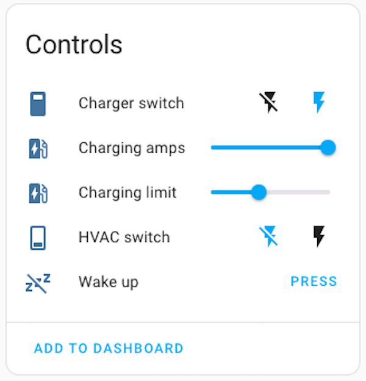
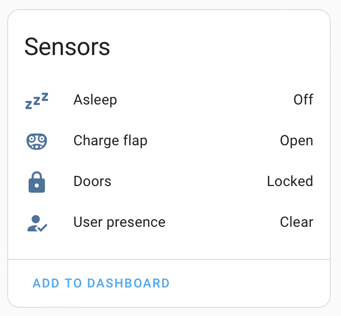
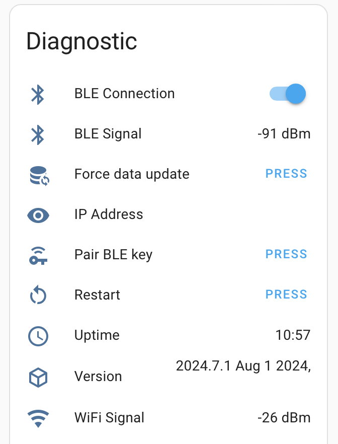
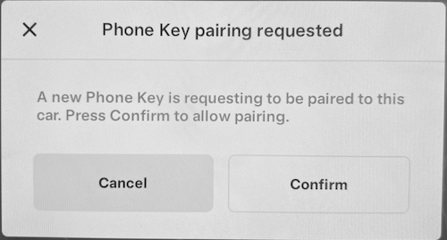
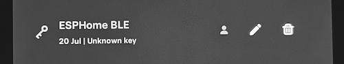

# ESPHome Tesla BLE

Manage your Tesla vehicle over BLE using an ESP32 — control charging, check battery status, lock/unlock, and more.

| Controls | Sensors | Diagnostic |
| - | - | - |
|  |  |  |

## Quick Start

1. Pick your install method:

| Method | How | Best for |
|--------|-----|----------|
| **ESPHome Device Builder** | Create a project, then add the board package | HA + ESPHome add-on users |
| **CLI** | `make compile && make upload` | Users with Python + [uv](https://docs.astral.sh/uv/) |

## Boards

Pick the config for your hardware:

| Board | Device Builder package | CLI |
|-------|------------------------|-----|
| **M5Stack NanoC6** | `tesla-ble-m5stack-nanoc6.dashboard.yml` | `BOARD=m5stack-nanoc6` |
| **M5Stack AtomS3** | `tesla-ble-m5stack-atoms3.dashboard.yml` | `BOARD=m5stack-atoms3` |
| **Generic ESP32** | `tesla-ble-esp32-generic.dashboard.yml` | `BOARD=esp32-generic` |

Other boards? Copy one from `boards/` and set it with `BOARD=<your-board>`.

The generic package targets the classic ESP32 (`esp32dev`). Do not use it for ESP32-C3, ESP32-S3, or other variants; select a matching board package or create one from `boards/` with the correct target settings.

## Features

- [x] Pair BLE key (DRIVER or CHARGING_MANAGER role)
- [x] Wake vehicle, set charging amps/limit, start/stop charging
- [x] Sensors: asleep/awake, locked/unlocked, user presence, charge port, BLE signal, IEC 61851
- [x] Charging sensors: battery level, charge rate, energy added, time to full, charger phases

## Installation

### ESPHome Device Builder (recommended)

If you run the [ESPHome add-on](https://esphome.io/guides/getting_started_hassio.html) in Home Assistant:

1. For a new, unflashed board, select **Create configuration** → **Create new project** and complete the name and Wi-Fi setup. For a board already running this project's firmware, use **Adopt** instead.
2. Open the device's YAML editor. Keep the generated `esphome`, `api`, and `wifi` sections, but remove the generated `esp32:` section. The board package below supplies the correct target and framework settings.
3. Add these entries to the `secrets.yaml` used by your ESPHome configuration. Find the vehicle MAC with an [Android BLE scanner](#via-android-ble-scanner-recommended-for-device-builder); iOS apps cannot reveal it.

```yaml
tesla_ble_mac_address: "A0:B1:C2:D3:E4:F5"
tesla_vin: "5YJ30123456789ABC"
ota_password: "a-unique-high-entropy-password"
```

4. Add the vehicle, OTA, and version settings to the top-level `substitutions` section:
```yaml
substitutions:
  # The left-hand names are fixed. Change only the secret names on the right.
  # Set this to main, a branch, a release tag, or a commit SHA.
  tesla_ble_ref: main
  ble_mac_address: !secret tesla_ble_mac_address
  tesla_vin: !secret tesla_vin
  ota_password: !secret ota_password
```

5. Add the board package under the top-level `packages` section. It provides the matching `esp32:` target, custom components, and required current ESPHome OTA configuration (`ota: - platform: esphome`). Do not add separate `esp32:`, `external_components:`, or `ota:` sections. For an M5Stack NanoC6:

```yaml
packages:
  yoziru.esphome-tesla-ble:
    url: https://github.com/yoziru/esphome-tesla-ble.git
    ref: ${tesla_ble_ref}
    files: [tesla-ble-m5stack-nanoc6.dashboard.yml]
```

6. Save and **Install**. Future firmware updates are applied from this same device card with **Update**.

Use `tesla-ble-m5stack-atoms3.dashboard.yml` for an AtomS3 or `tesla-ble-esp32-generic.dashboard.yml` for a generic ESP32. If the upload reaches 100% then fails with `ERROR receiving update end result: Finishing update failed`, the board file doesn't match the physical chip (seen with NanoC6 firmware flashed to an AtomS3) — the image compiles for any target but the device only accepts firmware built for its own chip, so switch `files:` to the `.dashboard.yml` matching your hardware and install again.

Set `tesla_ble_ref` once to test a branch, tag, or commit SHA. It selects both the YAML package and the custom C++ components. Local CLI builds need no override because they use the current checkout's `components/` directory.

The first flash needs the generated name, Wi-Fi, and API settings plus the three secrets above. See [Finding the BLE MAC](#finding-the-ble-mac) if you do not have the MAC yet.

#### Different board

No pre-made file for your board? Point `files:` at the shared package directly and supply the chip settings yourself. Targets outside classic ESP32, ESP32-C3, and ESP32-S3 need care.

```yaml
substitutions:
  tesla_ble_ref: main
  board: esp32-c6-devkitm-1
  variant: esp32c6
  flash_size: 4MB
  ble_mac_address: !secret tesla_ble_mac_address
  tesla_vin: !secret tesla_vin
  ota_password: !secret ota_password

packages:
  yoziru.esphome-tesla-ble:
    url: https://github.com/yoziru/esphome-tesla-ble.git
    ref: ${tesla_ble_ref}
    files: [packages/dashboard.yml]

esp32:
  framework:
    sdkconfig_options:
      CONFIG_OPENTHREAD_ENABLED: n
```

`board:`/`variant:`/`flash_size:` must match the physical chip — see `boards/esp32-generic.yml` for the minimal shape. Copy the `esp32:` framework block from the closest file in `boards/` (the `sdkconfig_options` above come from the NanoC6 board, for example).

For example, an adopted NanoC6 with the YAML generated by current ESPHome Device Builder should look like this. Preserve the generated name, friendly name, API key, and Wi-Fi secrets from your device.

```yaml
substitutions:
  name: tesla-ble-5b1980
  friendly_name: Tesla BLE 5b1980
  tesla_ble_ref: main
  charging_amps_max: "32"
  ble_mac_address: !secret tesla_ble_mac_address
  tesla_vin: !secret tesla_vin
  ota_password: !secret ota_password

packages:
  yoziru.esphome-tesla-ble:
    url: https://github.com/yoziru/esphome-tesla-ble.git
    ref: ${tesla_ble_ref}
    files: [tesla-ble-m5stack-nanoc6.dashboard.yml]

esphome:
  name: ${name}
  name_add_mac_suffix: false
  friendly_name: ${friendly_name}

api:
  encryption:
    key: !secret api_encryption_key

wifi:
  ssid: !secret wifi_ssid
  password: !secret wifi_password
```

Secret names are local to each user's dashboard. If yours differ, keep `ble_mac_address` and `tesla_vin` on the left and change only the names after `!secret`.

Add an `ota_password` secret before installing. Use a unique, high-entropy password; it protects the device's OTA update endpoint.

For multiple vehicles, create one ESPHome device per vehicle and map each device's substitutions to distinct secrets. For example, the second device can use `ble_mac_address: !secret model_y_ble_mac_address` and `tesla_vin: !secret model_y_tesla_vin`; the package and board configuration stay the same.

Or copy [`tesla-ble.example.yml`](./tesla-ble.example.yml) as a starting point for custom configs.

### CLI

Requires Python 3.10+, [uv](https://docs.astral.sh/uv/), and GNU Make.

```sh
cp secrets.yaml.example secrets.yaml   # edit with your details
make validate-config BOARD=m5stack-nanoc6  # check config first
make compile BOARD=m5stack-nanoc6         # build firmware
make upload BOARD=m5stack-nanoc6          # flash via USB
make logs                                 # view logs
```

For OTA updates after initial USB flash:
```sh
make discover                      # find your device on the network
make upload                        # OTA flash (uses saved suffix)
```

Available boards: `m5stack-nanoc6`, `m5stack-atoms3`, `esp32-generic`.

All `make` commands accept `BOARD=<board>` to select the target hardware.

## Configuration

### BLE Key Role

The `role` determines what the paired BLE key can do (set during pairing):

- **DRIVER** (default) — full access: lock/unlock, frunk/trunk, windows, honk, climate, charging
- **CHARGING_MANAGER** — charging only: start/stop, set amps, set limit, open charge port, basic info

The Tesla backend enforces these restrictions. Change requires re-pairing.

### Polling

```yaml
tesla_ble_vehicle:
  vcsec_poll_interval: 10               # Status updates (always safe, low power)
  infotainment_poll_interval_awake: 30  # Detailed data when idle
  infotainment_poll_interval_active: 10 # Detailed data when charging/sentry mode
  infotainment_sleep_timeout: 660       # Idle seconds before letting the car sleep (default 11 min)
```

The system only polls infotainment data during an 11-minute wake window, then lets the car sleep. Active charging and sentry mode keep it awake for continuous updates. A car that is merely left unlocked, or that reports user presence because a phone is in range, is treated as idle — the integration backs off and lets it sleep regardless. VCSEC status polling is low-power and does not affect vehicle sleep.

## Usage

### Finding the BLE MAC

Your vehicle constantly advertises via BLE with a name derived from its VIN (format: `S` + 16 hex chars + `C`). This advertisement comes from VCSEC (vehicle security controller) which is always powered — no need to wake the car. You need the MAC address of that advertisement to configure the ESP32.

The `tesla_ble_listener` component is included in the firmware but disabled by default. You enable it temporarily, find the MAC, then disable it.

#### Via CLI

In a local checkout of this repo:

1. **Uncomment** `listener: !include listener.yml` in `packages/base.yml`
2. Add `tesla_vin` to `secrets.yaml`
3. Build, flash, and watch logs:
   ```sh
   make compile BOARD=m5stack-nanoc6 && make upload BOARD=m5stack-nanoc6
   make logs
   ```
4. Note the MAC from the log output
5. **Re-comment** the line in `packages/base.yml` and run `make clean`
6. Add `ble_mac_address` to `secrets.yaml`, rebuild, and reflash

#### Via Android BLE Scanner (recommended for Device Builder)

Use an Android BLE scanner app such as nRF Connect, scan nearby devices, and look for one with an 18-character name starting with **S** and ending with **C** (e.g., `S1a87a5a75f3df858C`). Record its MAC address. iOS scanner apps cannot display Bluetooth MAC addresses because Apple blocks that information; use an Android device or the [CLI listener](#via-cli) instead.

### Pairing the BLE Key

1. Sit in your car with the ESP32 powered and within BLE range
2. In Home Assistant: **Settings → Devices & Services → ESPHome → your device → "Pair BLE key"**
3. Tap your NFC key card to the center console **immediately**
4. A prompt appears on the car's screen — tap **confirm**

   

5. Verify: go to **Controls → Locks** in the car — you'll see a new key named "Unknown device"

   

6. [Optional] Rename it to "ESPHome BLE"

> No popup? Press "Pair BLE key" and tap your card again. Make sure BLE MAC and VIN are correct.

### Adding to Home Assistant

**Settings → Devices & Services → Add Integration → ESPHome**. Enter the device's IP (find it in your router or from ESPHome Device Builder) and your API encryption key.

### Make commands reference

| Command | What it does |
|---------|-------------|
| `make validate-config BOARD=<board>` | Check YAML without building |
| `make compile BOARD=<board>` | Build firmware |
| `make upload BOARD=<board>` | Flash via USB (add `HOST_SUFFIX` for OTA) |
| `make logs` | View live device logs |
| `make discover` | Find ESPHome devices on your network, saves suffix for OTA |
| `make clean` | Delete build artifacts (do this when changing config) |
| `make help` | Show all commands |

## Troubleshooting

| Symptom | Likely cause |
|---------|-------------|
| "Found Tesla vehicle" never appears | The listener isn't enabled. For CLI: uncomment `listener: !include listener.yml` in `packages/base.yml`. For Device Builder, use an Android BLE scanner before creating the vehicle package. VCSEC always advertises — no need to wake the car. |
| Pairing fails with HMAC error | BLE MAC or VIN is wrong. Verify both in `secrets.yaml`. |
| Car stays awake | Active charging or sentry mode keep it awake. Otherwise the integration backs off after `infotainment_sleep_timeout` of idle time and lets the car sleep — watch the log for `Polling Infotainment (sleeping - NO_WAKE_SKIP)`. |
| `Unknown` on boot | Normal for some sensors — VCSEC corrects within ~10s. |
| Compile errors | Board mismatch? Run `make clean`, then `make compile` again. |
| `uv: command not found` | Install [uv](https://docs.astral.sh/uv/getting-started/installation/) |
